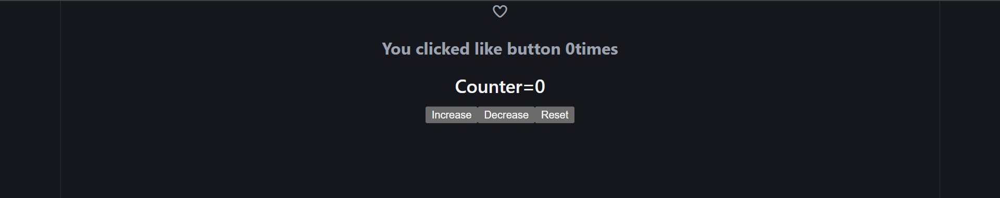
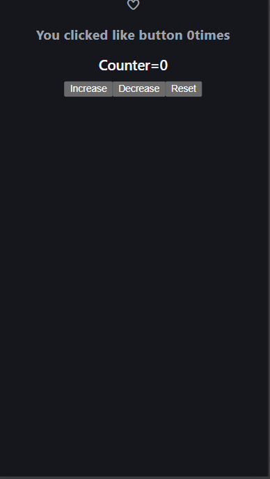

# ❤️ React Like Button & Counter App

A beginner-friendly React project built with **Vite** that demonstrates core React concepts — `useState`, `useEffect`, component composition, and event handling — through a like button and an interactive counter.

---

## 📸 Preview

-🖥️

-📱

---


---

## 📁 Project Structure

```
src/
├── main.jsx        # App entry point, mounts React to the DOM
├── App.jsx         # Root component — Like button logic & state
|__ LikeButton.jsx  # Extracted Like button component with toggle & click count
├── Counter.jsx     # Reusable Counter component with increase/decrease/reset
├── App.css         # Component-level styles
└── index.css       # Global styles & CSS variables (light/dark theme)
```

---

## ✨ Features

- **Like Button** — Toggle a heart icon (filled/outline) using Font Awesome icons, with a live click counter
- **Counter Component** — Standalone counter with increase, decrease, and reset buttons
- **Dark Mode Support** — Automatic dark/light theme via CSS `prefers-color-scheme`
- **Reusable Components** — `Counter` is built as a self-contained, importable component

---

## 🧠 Concepts Covered

| Concept | Where Used |
|---|---|
| `useState` | Like toggle, like count, counter value |
| `useEffect` | Console log on every render (in `Counter.jsx`) |
| Functional updater form | `setCount`, `setIsLiked`, `setcalculateLike` |
| Conditional rendering | Heart icon switches based on `isLiked` state |
| Component composition | `<Counter />` rendered inside `<App />` |
| Inline styles | `likeStyle` object applied to the heart icon |
| CSS variables | Theme colors defined in `:root` in `index.css` |

---

## 🚀 Getting Started

 
### Installation

```bash
# 1. Create Project
npm create vite@latest like-button-and-counter

# 3. Start the development server
npm run dev
```
 

## 🔗 External Dependencies

- **[Font Awesome](https://fontawesome.com/)** — Used for heart icons (`fa-heart`). Make sure to include the Font Awesome CDN in your `index.html`:

```html
<link rel="stylesheet" href="https://cdnjs.cloudflare.com/ajax/libs/font-awesome/6.5.0/css/all.min.css" />
```

---

## 📝 Notes & Known Behavior

- **`useEffect` in `Counter.jsx`** runs after every render (no dependency array). This is intentional for learning/practice purposes — in production you'd add a dependency array.
- **`StrictMode` is commented out** in `main.jsx`. When enabled, React runs effects twice in development to help detect side effects.
- The like counter only increments — it does not decrement when you unlike. This is by design for simplicity.

---

## 🛠️ Tech Stack

| Tool | Purpose |
|---|---|
| [React 18](https://react.dev/) | UI library |
| [Vite](https://vitejs.dev/) | Dev server & build tool |
| CSS (with nesting) | Styling & theming |

---

## 📸 Component Overview

### `App.jsx`
The root component.Clean and minimal — simply composes <LikeButton /> and <Counter /> together. All state logic has been moved into their respective components.

### `LikeButton.jsx`
Extracted from App.jsx as its own dedicated component. Manages two pieces of state — isLiked (toggle) and calculateLike (total click count). Renders a Font Awesome heart icon that switches between filled and outline based on the liked state.

### `Counter.jsx`
A self-contained counter component with three buttons (Increase / Decrease / Reset) and a `useEffect` that logs to the console on every render.

---

## 🧑‍💻 Author

**Sameer Khan**  
GitHub: [@sameer-khan-dev](https://github.com/sameer-khan-dev)
LinkedIn: [Sameer Khan](https://www.linkedin.com/in/sameer-khan-858a3137a)

---
*Built while learning React — hooks, state, effects, and component design.*
