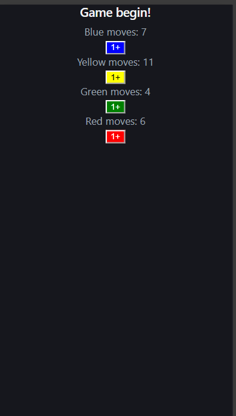

# 🎲 Ludo Move Tracker

A simple React-based Ludo move counter that tracks the number of moves made by each of the four players — Blue, Yellow, Green, and Red.

---

## 📸 Preview

-🖥️

-📱


---
---

## 📁 Project Structure

```
src/
├── main.jsx          # App entry point
├── App.jsx           # Root component
├── App.css           # App-level styles
├── index.css         # Global styles and CSS variables
└── LudoBoard.jsx     # Core Ludo board component with move tracking
```

---

## ✨ Features

- Tracks move counts independently for all 4 players
- One-click move increment button per player
- Color-coded buttons matching each player's token color
- Responsive layout with light/dark mode support via CSS variables

---

  ## 🚀 Getting Started

```bash
# Create project
npm create vite@latest ludo-board

# Start dev server
npm run dev
```

---

## 🧩 Component Overview

### `LudoBoard.jsx`

The main game component. It maintains a shared `moves` state object with keys for each player (`blue`, `yellow`, `green`, `red`). Each player has:

- A paragraph showing their current move count
- A colored button to increment their count by 1

**State shape:**
```js
{
  blue: 0,
  yellow: 0,
  green: 0,
  red: 0
}
```

---

## 🛠️ Built With

- [React](https://react.dev/) — UI library
- [Vite](https://vitejs.dev/) — Build tool and dev server

---

## 📌 Future Improvements

- Add dice roll simulation
- Add win condition detection
- Render an actual visual Ludo board
- Add player name customization
- Add undo/reset functionality per player

---

---

## 🧑‍💻 Author

**Sameer Khan**  
GitHub: [@sameer-khan-dev](https://github.com/sameer-khan-dev)
LinkedIn: [Sameer Khan](https://www.linkedin.com/in/sameer-khan-858a3137a)

---