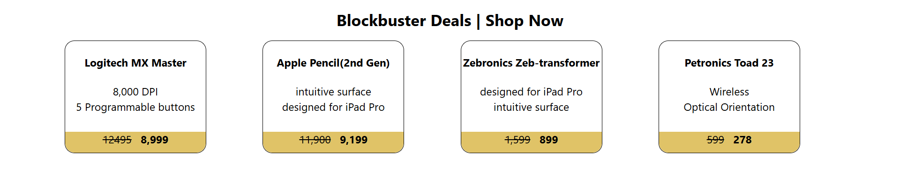
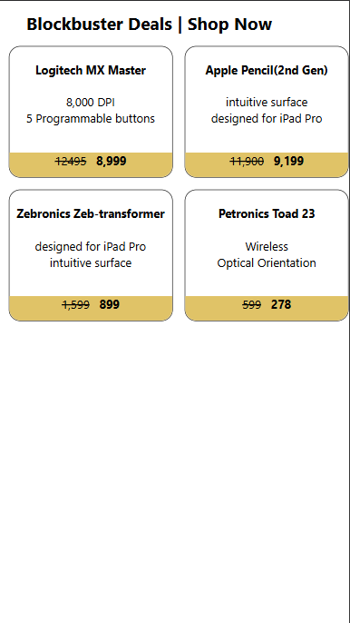

# 🛍️ Blockbuster Deals — React Product Card App

A beginner React project that renders a responsive product listing with dynamic pricing, built as a hands-on exercise to learn component-based architecture, props, and CSS Grid.

---

## 📸 Preview

-🖥️
-📱

---

## 🚀 Features

- **Component-based architecture** — `App`, `Product`, and `Price` components with clear separation of concerns
- **Props-driven data flow** — product titles, descriptions, and prices passed via props
- **Dynamic pricing display** — strikethrough old price alongside bold new price
- **Responsive grid layout** — 4-column grid on desktop, 2-column on mobile (≤441px)
- **Reusable components** — `Product` and `Price` are designed to be reused across any number of items

---

## 🗂️ Project Structure

```
src/
├── App.jsx          # Root component — renders the product grid
├── App.css          # CSS Grid layout + responsive breakpoints
├── Product.jsx      # Product card — title, description, and price
├── Product.css      # Card styling — border, border-radius, dimensions
├── Price.jsx        # Price display — old (strikethrough) + new (bold)
├── main.jsx         # Entry point — mounts App into #root
└── index.css        # Global styles — typography, body reset, root layout
```

---

## 🧩 Component Breakdown

### `<App />`
The top-level component. Renders the page heading and maps out four `<Product />` components, each receiving a `title` and an `idx` prop.

### `<Product title idx />`
Displays a single product card. Uses `idx` to look up the relevant description and price from internal arrays, then passes them down to `<Price />`.

| Prop    | Type     | Description                        |
|---------|----------|------------------------------------|
| `title` | `string` | Product name shown as a heading    |
| `idx`   | `number` | Index to look up price/description |

### `<Price oldPrice newPrice />`
A presentational component that renders the pricing bar at the bottom of each card.

| Prop       | Type     | Description              |
|------------|----------|--------------------------|
| `oldPrice` | `string` | Original price (struck through) |
| `newPrice` | `string` | Discounted price (bold)  |

---

## 📦 Products Featured

| # | Product                     | Old Price | New Price |
|---|-----------------------------|-----------|-----------|
| 0 | Logitech MX Master          | ₹12,495   | ₹8,999    |
| 1 | Apple Pencil (2nd Gen)      | ₹11,900   | ₹9,199    |
| 2 | Zebronics Zeb-transformer   | ₹1,599    | ₹899      |
| 3 | Petronics Toad 23           | ₹599      | ₹278      |

---

## 🛠️ Getting Started

### Prerequisites
- [Node.js](https://nodejs.org/) (v18+)
- npm or yarn

### Setup

```bash
 npm create vite@latest product-banner
```

### Running Locally

```bash
npm run dev
```

## 📐 Responsive Design

| Breakpoint   | Layout              |
|--------------|---------------------|
| > 441px      | 4-column CSS Grid   |
| ≤ 441px      | 2-column CSS Grid   |

---

## 💡 Concepts Practised

This project was built while learning:

- ✅ **React functional components**
- ✅ **Props** — passing data from parent to child
- ✅ **Component composition** — nesting `Price` inside `Product` inside `App`
- ✅ **Inline styles** in JSX (`style={{ ... }}`)
- ✅ **External CSS** with class-based and element selectors
- ✅ **CSS Grid** for responsive layouts
- ✅ **`position: absolute`** for the pinned price bar

---

## 🔮 Possible Improvements

- [ ] Move product data to a separate `data.js` file or fetch from an API
- [ ] Add product images
- [ ] Introduce `useState` for a cart or wishlist feature
- [ ] Add hover animations and transitions to cards
- [ ] Replace hardcoded arrays with `Array.map()` in `App.jsx`

---

## 🧑‍💻 Author

**Sameer Khan**  
GitHub: [@sameer-khan-dev](https://github.com/sameer-khan-dev)
LinkedIn: [Sameer Khan](https://www.linkedin.com/in/sameer-khan-858a3137a)

---
 