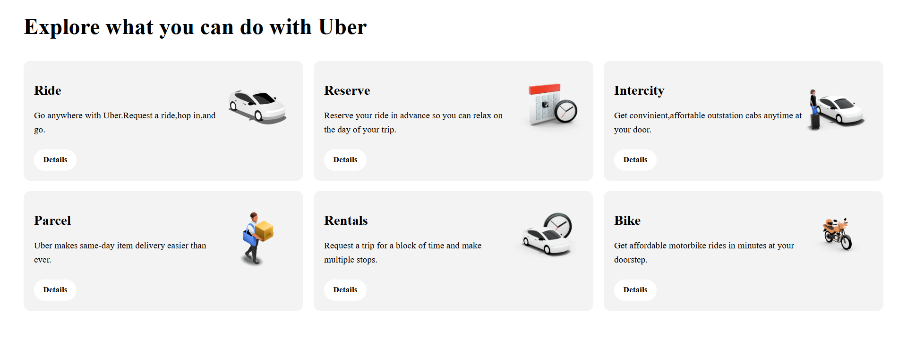
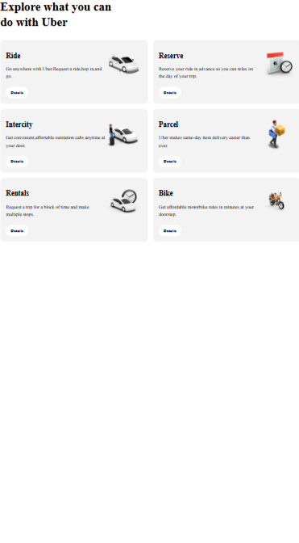

# 🚗 Uber Products Banner

A React practice project that recreates the **"Explore what you can do with Uber"** product card section from Uber's homepage.

---

## 📸 Preview

A responsive grid of six product cards — **Ride, Reserve, Intercity, Parcel, Rentals, and Bike** — each with a title, description, image, and a details link button.

-🖥️

-📱


---

## 🛠️ Tech Stack

- **React** (with Vite)
- **CSS Modules** (plain `.css` files per component)
- No external libraries or UI frameworks

---

## 📁 Project Structure

```
src/
├── assets/              # Product images (PNG)
├── App.css              # Page heading styles
├── App.jsx              # Root component            
├── main.jsx             # React DOM entry point
├── Product.css          # Individual card styles
├── Product.jsx          # Single product card component
├── ProductTab.css       # Grid layout styles
└── ProductTab.jsx       # Renders all 6 product cards
```

---

## 🧩 Components

### `<App />`
The root component. Renders the page heading and the `<ProductTab />`.

### `<ProductTab />`
Holds the CSS Grid layout and renders six `<Product />` cards with their respective title and image props.

### `<Product />`
A reusable card component. Accepts:

| Prop    | Type     | Description                        |
|---------|----------|------------------------------------|
| `title` | `string` | Name of the product (e.g. "Ride")  |
| `idx`   | `number` | Index to pick description from array |
| `image` | `string` | Imported image asset path          |

---

## ✨ Features

- Responsive grid: **3 columns** on desktop → **2 columns** on screens ≤ 771px
- Clean card layout with image, title, description, and a pill-shaped details button

---

## 🚀 Getting Started

```bash
# Create project
npm create vite@latest uber-explore-cards

# Start dev server
npm run dev
```

---

## 🔧 Known Improvements (To-Do)

- [ ] Move the `description` array outside the `Product` component (currently re-created on every render)
- [ ] Replace `id="card-img"` and `id="link"` with `className` — IDs must be unique per page
- [ ] Pass `idx` as a number `{0}` instead of a string `"0"`
- [ ] Replace `<a href="#">` with real routes using React Router
- [ ] Extract descriptions into a separate `data.js` constants file
- [ ] Remove description & button on small screens

---

## 📚 What I Practised

- Breaking UI into reusable components
- Passing and using props
- CSS Grid with responsive breakpoints
- Structuring a Vite + React project

---

---

## 🧑‍💻 Author

**Sameer Khan**  
GitHub: [@sameer-khan-dev](https://github.com/sameer-khan-dev)
LinkedIn: [Sameer Khan](https://www.linkedin.com/in/sameer-khan-858a3137a)

---
*Practice project — UI inspired by Uber's homepage.*
